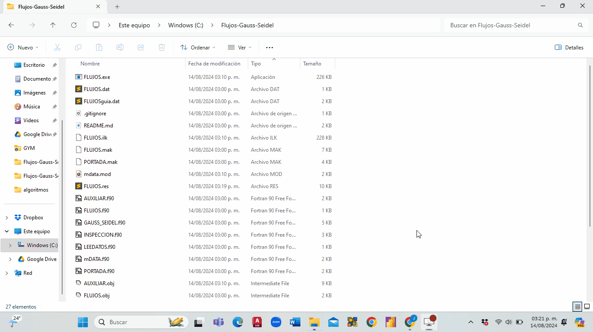

<h1>FLUJOS DE POTENCIA POR GAUSS SEIDEL</h1>

## INTRODUCCIÓN

Programa computacional para el calculo de flujos de potencia en el régimen permanente equilibrado

## :hammer_and_wrench: INSTRUCCIONES
- Realiza un git clone del repositorio
- Abre Microsoft Developer Studio
- Haz click en la pestaña "File"
- Haz click en "OpenWorkspace..."
- dirigete a la dirección donde realizaste el git clone de la carpeta "Flujos-Gauss-Seidel"
- Selecciona la opción "FLUJOS.mdp" y haz click en OK
- O simplemente haz doble click en la opción "FLUJOS.mdp"
- Para este punto ya tendrás abierta la carpeta en MIcrosoft Developer
- abre la pestaña "Build"
- Haz click en Compile FLUJOS.f90
- Haz click en Build FLUJOS.exe (para generar el archivo ejecutable)
- Haz click en Execute FLUJOS.exe
- Para este punto se abrira una terminal donde primero te pedirá ingresar el nombre del archivo de datos: El archivo de datos que esta dentro del repositorio se llama: FLUJOS.dat, ingresalo para probar el programa o ingresa tu propio archivo de datos
- Ahora te pedira el nombre del archivo donde se guardarán los resultados, puedes ingresar el nombre que quieras, se recomiendo usar: "FLUJOS.res"
- Una vez ingresado los datos anteriores se ejecutará el programa y mostrará los resultados tanto en la pantalla como en el archivo de resultados

## Cómo clonar y compilar el programa

  

## Archivo ejecutable.exe

Cuando ya se compilo el programa se genera tu archivo.exe

  

<!--   Forma alternativa de ingresar un gif                  -->
<!--     -->
<!--         -->

Programa desarrollado en Fortran 90

Compilador usado: Fortran Power Station, ver. 4.0

## YO HACIENDO EL PROGRAMA

    
    <!--  -->  

## AUTORES
| [  J.J. Trejo M. ](https://github.com/Yisus-1) |
| :---: |
